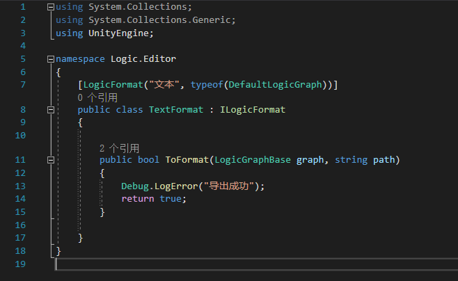
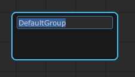
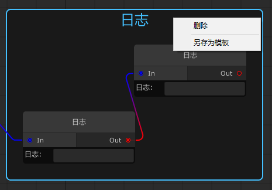

<!--当前Markdown用的转移器为Markdown Preview 插件-->
<h1 align="center">逻辑图使用说明</h1>

# 目录
1. [使用说明](#使用说明)
   1. [逻辑图](#逻辑图)
       1. [创建逻辑图](#创建逻辑图)
       2. [打开逻辑图](#打开逻辑图)
       3. [刷新逻辑图](#刷新逻辑图)
       4. [修改逻辑图名字](#修改逻辑图名)
       5. [自定义逻辑图](#自定义逻辑图)
       6. [另存逻辑图](#另存逻辑图)
       7. [导出逻辑图](#导出逻辑图)
   2. [节点](#节点)
       1. [添加节点](#添加节点)
       2. [修改节点名](#修改节点名)
       3. [连接节点](#连接节点)
       4. [断开节点](#断开节点)
       5. [查看节点代码](#查看节点代码)
       6. [自定义节点](#自定义节点)
   3. [组](#组)
       1. [添加组](#添加组)
       2. [修改组名](#修改组名)
       3. [节点添加到组](#节点添加到组)
       4. [从组中移除节点](#从组中移除节点)
       5. [自定义组](#自定义组)
       6. [修改自定义组](#修改自定义组)
       7. [删除自定义组](#删除自定义组)
   4. [快捷键](#快捷键)
       1. [选中节点](#选中节点)
       2. [选中组](#选中组)
       3. [其他](#其他)
2. [常用API](#API)
   1. [运行时API](#运行时API)
      1. [LogicRuntime.cs(逻辑图运行)](#LogicRuntime)
      2. [LogicGraphBase.cs(逻辑图基类)](#LogicGraphBase)
      3. [LogicGraphAttribute.cs(逻辑图特性)](#LogicGraphAttribute)
      4. [LogicNodeBase.cs(逻辑图节点基类)](#LogicNodeBase)
      5. [LogicNodeAttribute.cs(逻辑图节点特性,推荐在编辑时使用)](#LogicNodeAttribute)
      6. [ILogicFormat.cs(逻辑图导出接口,推荐在编辑时使用)](#ILogicFormat)
      7. [LogicFormatAttribute.cs(逻辑图导出特性,推荐在编辑时使用)](#LogicFormatAttribute)
   2. [编辑时API](#编辑时API)
      1. [LogicNodeBaseView.cs(逻辑图节点视图)](#LogicNodeBaseView)
3. [更多功能](#更多功能)


## <a id="使用说明">一.使用说明</a>
    第一次导入插件时,请先刷新逻辑图
---
## <a id="逻辑图">逻辑图</a>
<!----------------------------------------逻辑图开始---------------------------------------->
### <a id="创建逻辑图">1.创建逻辑图</a>
> &ensp;
> **点击菜单栏中的 Framework->逻辑图->创建逻辑图**
> 
> **打开逻辑图窗口后点击右键选择<font color=#f00>创建逻辑图</font> 选项**
> 
> *此处会列出所有类型的逻辑图*
> **逻辑图创建后会自动添加一个开始节点,即当前逻辑图的入口所在,如下图所示<font color=#0f0>绿色节点</font>**
> 
> *该节点无法删除和被连接*
> &ensp;

### <a id="打开逻辑图">2.打开逻辑图</a>
> &ensp;
> **1.点击菜单栏中的 Framework->逻辑图->打开逻辑图**
> 
> **打开逻辑图窗口后点击右键选择<font color=#f00>打开逻辑图</font>选项**
> 
> *项目中所有的逻辑图会按照逻辑图类型分类显示*
> **2.选中逻辑图的自选文件,在Inspector视图中点击打开**
> &ensp;

### <a id="刷新逻辑图">3.刷新逻辑图</a>
> &ensp;
> **点击菜单栏中的 Framework->逻辑图->刷新逻辑图**
> 
> *刷新逻辑图用于刷新项目中所有逻辑图的缓存,一般在第一次导入插件的时候可能用到*
> &ensp;

### <a id="修改逻辑图名">4.修改逻辑图名字</a>
> &ensp;
> **双击逻辑图窗口左上角,即下图所示红色区域进入名称编辑模式**
> 
> *起一个容易记得名字,方便后续修改*
> &ensp;

### <a id="自定义逻辑图">5.自定义逻辑图</a>
> &ensp;
> **用户可以自定义属于自己的逻辑图**
> **1.点击Assets->Create->LogicGraph->Graph C# Script创建新的逻辑图类型**
> **2.添加LogicGraph(名称)特性**
> 
> *自定义逻辑图类型*
> &ensp;

### <a id="另存逻辑图">6.另存逻辑图</a>
> &ensp;
> **当打开逻辑图后,在逻辑图空白处点击鼠标右键,即出现另存为菜单<font color=#f00>另存为文件路径不能与当前文件路径相同</font>**
> &ensp;

### <a id="导出逻辑图">7.导出逻辑图</a>
> &ensp;
> **将逻辑图导出成目标文件,自定义格式规范是针对于具体的逻辑图定制的**
> **1.首先自定义导出格式规范,新建C# Script文件使其实现ILogicFormat接口**
> **2.添加特性LogicFormat(格式名,适用逻辑图,文件后缀=txt)**
> 
> **完胜上述步骤,在逻辑图空白处点击鼠标右键则会看到该规则,如下图**
> 
> &ensp;

---
<!----------------------------------------节点开始---------------------------------------->
## <a id="节点">节点</a>

### <a id="添加节点">1.添加节点</a>
> &ensp;
> **在逻辑图空白处点击鼠标右键选择创建节点菜单,及弹出节点选择窗口**
> **用户选定节点后会在右键时的鼠标位置创建当前节点**
> 
> &ensp;

### <a id="修改节点名">2.修改节点名</a>
> &ensp;
> **双击现有的标题即变成编辑模式**
>  $\Longrightarrow$ 
> &ensp;


### <a id="连接节点">3.连接节点</a>
> &ensp;
> **选中节点上Out圆点,将其拖拽到被激活的In圆点上**
> 
> &ensp;

### <a id="断开节点">4.断开节点</a>
> &ensp;
> **第一种:选中连线按下Delete按键**
> **第二种:右键节点进行断开或者移除连接操作**
> 
> *断开:取消链接父节点。移除:取消链接子节点*
> &ensp;

### <a id="查看节点代码">5.查看节点代码</a>
>0 &ensp;
> **右键节点出现`查看节点代码`和`查看界面代码`,用于快速定位节点逻辑代码或者节点视图代码**
> 
> &ensp;

### <a id="自定义节点">6.自定义节点</a>
> &ensp;
> **用户可以自定义属于自己的逻辑节点**
> **1.点击Assets->Create->LogicGraph->Node C# Script创建新的逻辑节点**
> 
> **2.将新建出来的<font color=#f00>节点View.cs</font>移动至Editor文件夹下**
> **3.将<font color=#f00>节点View.cs</font>取消注释**
> **4.在<font color=#f00>节点View.cs</font>中添加LogicNode(节点类型,菜单名,适用逻辑图)特性**
> 
> &ensp;

---
<!----------------------------------------组开始---------------------------------------->

## <a id="组">组</a>
### <a id="添加组">1.添加组</a>
> &ensp;
> **在新建节点中可以看到组的页签**
> **点击后选择想要创建的预设组**
> 
> &ensp;

### <a id="修改组名">2.修改组名</a>
> **双击现有的组名即变成编辑模式**
>  $\Longrightarrow$ 
> &ensp;

### <a id="节点添加到组">3.节点添加到组</a>
> &ensp;
> **拖动需要添加到组的节点置于组节点上即可**
> &ensp;

### <a id="从组中移除节点">4.从组中移除节点</a>
> &ensp;
> **按住Shift拖动组中的节点即可**
> &ensp;

### <a id="自定义组">5.自定义组</a>
> &ensp;
> **1.添加一个默认组**
> 
> **2.将需要编组的节点添加到刚才创建的组**
> 
> **3.右键组->另存为新组**
> 
> *自定义的组会在组的标签内显示,自定义组的名称为唯一的*
> &ensp;

### <a id="修改自定义组">6.修改自定义组</a>
> &ensp;
> **1.当前组不是默认组**
> **2.右键组->保存当前组**
> &ensp;

### <a id="删除自定义组">7.删除自定义组</a>
> &ensp;
> **1.当前组不是默认组**
> **2.右键组->删除当前组**
> &ensp;

---
## <a id="快捷键">快捷键</a>

### <a id="选中节点">1.选中节点</a>
> &ensp;
> 1.Ctrl+D 	$\longrightarrow$ 创建一个选中节点的副本
> 2.Delete 	$\longrightarrow$ 删除山中节点
> &ensp;

### <a id="选中组">2.选中组</a>
> &ensp;
> 1.Ctrl+D 	$\longrightarrow$ 创建一个选中组的副本
> 2.Delete 	$\longrightarrow$ 删除选中组
> &ensp;

### <a id="其他">3.其他</a>
> &ensp;
> 1.Ctrl+S 	$\longrightarrow$ 保存当前逻辑图
> &ensp;

---

## <a id="API">二.常用API</a>
    以下是常用API说明,非常用或者内部的自行看源码

## <a id="运行时API">运行时API</a>

### <a id="LogicRuntime">1.LogicRuntime.cs</a>
> &ensp;
> **逻辑图默认启动器,此文件仅供参考,不可作为<font color=red>生产代码</font>应用**
> ### Constructors
> | Name         | Des            | Params | Return |
> | ------------ | -------------- | ------ | ------ |
> | LogicRuntime | 单例类构造函数 |        |        |
> ### Static Variables
> | Name         | Des            | Params | Return |
> | ------------ | -------------- | ------ | ------ |
> | LogicRuntime | 单例类构造函数 |        |        |
> ### Public Functions
> | Name    | Des            | Params                | Return       |
> | ------- | -------------- | --------------------- | ------------ |
> | Begin   | 开始一个逻辑图 | LogicGraphBase        | 逻辑图执行Id |
> | Begin   | 开始一个逻辑图 | LogicGraphBase,Action | 逻辑图执行Id |
> | Stop    | 停止一个逻辑图 | int                   |              |
> | StopAll | 停止全部逻辑图 |                       |              |
> &ensp;

### <a id="LogicGraphBase">2.LogicGraphBase.cs</a>
> &ensp;
> **逻辑图基类,不同的子类可用于区分不同的逻辑图节点及数据**
> ### Public Variables
> | Name          | Des          | Params | Return |
> | ------------- | ------------ | ------ | ------ |
> | LogicNodeList | 所有节点集合 |        |        |
> | DefaultNode   | 默认开始节点 |        |        |
> ### Public Functions
> | Name   | Des                                    | Params | Return |
> | ------ | -------------------------------------- | ------ | ------ |
> | Begin  | 开始逻辑图                             |        |        |
> | Begin  | 开始逻辑图                             | Action |        |
> | Update | 逻辑图更新方法(需要在外面Update中调用) |        |        |
> | Stop   | 停止一个逻辑图                         |        |        |
> ### Example
> ```Csharp
> #if UNITY_EDITOR
> [LogicGraph("默认逻辑图")]
> #endif
> public class DefaultLogicGraph : LogicGraphBase
> {
> }
> ```
> &ensp;

### <a id="LogicGraphAttribute">3.LogicGraphAttribute.cs</a>
> &ensp;
> **逻辑图特性,需要添加到继承[LogicGraphBase](#LogicGraphBase)子类中**
> ### Constructors
> | Name                | Des      | Params | Return |
> | ------------------- | -------- | ------ | ------ |
> | LogicGraphAttribute | 构造函数 | String |        |
> ### Example
> ```Csharp
> #if UNITY_EDITOR
> [LogicGraph("默认逻辑图")]
> #endif
> public class DefaultLogicGraph : LogicGraphBase
> {
> }
> ```
> &ensp;

### <a id="LogicNodeBase">4.LogicNodeBase.cs</a>
> &ensp;
> **逻辑图节点基类,所有需要用到的节点都需要继承此类型**
> ### Public Variables
> | Name       | Des                              | Params | Return |
> | ---------- | -------------------------------- | ------ | ------ |
> | OnlyId     | 当前节点唯一Id                   |        |        |
> | Parents    | 当前节点所有父节点               |        |        |
> | Childs     | 当前节点所有子节点               |        |        |
> | IsComplete | 当前节点是否执行完成,默认为False |        |        |
> | IsSkip     | 是否跳过子节点,默认False         |        |        |
> ### Public Functions
> | Name      | Des                                | Params | Return  |
> | --------- | ---------------------------------- | ------ | ------- |
> | Init      | 初始化当前节点                     |        | Boolean |
> | OnEnter   | 开始执行节点之前调用               | Action | Boolean |
> | OnExecute | 执行逻辑节点                       |        | Boolean |
> | OnStop    | 当逻辑图停止时且节点正在执行时调用 |        | Boolean |
> ### Example
> ```Csharp
> public class DebugNode : LogicNodeBase
> {
>     /// <summary>
>     /// 日志
>     /// </summary>
>     public string Log = "";
>
>     public override bool OnExecute()
>     {
>         Debug.LogError(Log);
>         return base.OnExecute();
>     }
> }
> ```
> &ensp;

### <a id="LogicNodeAttribute">5.LogicNodeAttribute.cs</a>
> &ensp;
> **逻辑图节点特性,需添加到<font color=red>节点视图类</font>中**
> ### Constructors
> | Name               | Des      | Params             | Return |
> | ------------------ | -------- | ------------------ | ------ |
> | LogicNodeAttribute | 构造函数 | Type,String,Type[] |        |
> ### Example
> ```Csharp
> [LogicNode(typeof(DebugNode), "系统/日志")]
> public class DebugNodeView : LogicNodeBaseView
> {
>     private DebugNode node;
> 
>     public override void OnCreate()
>     {
>         Width = 200;
>         node = Target as DebugNode;
>     }
>     public override void ShowUI()
>     {
>         var text = GetTextField("日志:", node.Log);
>         text.RegisterCallback<InputEvent>(onInputEvent);
>         this.AddUI(text);
>     }
>     private void onInputEvent(InputEvent evt)
>     {
>         node.Log = evt.newData;
>     }
> }
> ```
> &ensp;

### <a id="ILogicFormat">6.ILogicFormat.cs</a>
> &ensp;
> **逻辑图导出接口,推荐在编辑器中使用**
> ### Public Functions
> | Name     | Des        | Params                | Return  |
> | -------- | ---------- | --------------------- | ------- |
> | ToFormat | 格式化节点 | LogicGraphBase,String | Boolean |
> ### Example
> ```Csharp
> [LogicFormat("文本", typeof(DefaultLogicGraph),"txt")]
> public class TextFormat : ILogicFormat
> {
>
>    public bool ToFormat(LogicGraphBase graph, string path)
>    {
>         Debug.LogError("导出成功");
>         return true;
>    }
> }
> ```
> &ensp;
> 
### <a id="LogicFormatAttribute">7.LogicFormatAttribute.cs</a>
> &ensp;
> **逻辑图导出特性,推荐在编辑器中使用**
> ### Constructors
> | Name                 | Des      | Params             | Return |
> | -------------------- | -------- | ------------------ | ------ |
> | LogicFormatAttribute | 构造函数 | String,Type,String |        |
> ### Example
> ```Csharp
> [LogicFormat("文本", typeof(DefaultLogicGraph),"txt")]
> public class TextFormat : ILogicFormat
> {
>
>    public bool ToFormat(LogicGraphBase graph, string path)
>    {
>         Debug.LogError("导出成功");
>         return true;
>    }
> }
> ```
> &ensp;

---

## <a id="编辑时API">编辑时API</a>

### <a id="LogicNodeBaseView">1.LogicNodeBaseView.cs</a>
> &ensp;
> ### Public Variables
> | Name      | Des                        | Params | Return |
> | --------- | -------------------------- | ------ | ------ |
> | OnlyId    | 当前视图唯一Id与节点一致   |        |        |
> | NodeData  | 当前视图的缓存视图数据     |        |        |
> | Target    | 当前视图对应的节点对象     |        |        |
> | Input     | 进端口                     |        |        |
> | Output    | 出端口                     |        |        |
> | Width     | 当前视图的宽               |        |        |
> | m_content | 当前视图自定义元素的父节点 |        |        |
> ### Public Functions
> | Name                | Des                                               | Params                       | Return  |
> | ------------------- | ------------------------------------------------- | ---------------------------- | ------- |
> | Initialize          | 初始化,底层自动调用                               | LogicPanelData,LogicNodeData |         |
> | AddParent           | 添加当前节点的父节点                              | LogicNodeBaseView            |         |
> | RemoveParent        | 移除当前节点的父节点                              | LogicNodeBaseView            |         |
> | AddChild            | 添加当前节点的子节点                              | LogicNodeBaseView            |         |
> | RemoveChild         | 移除当前节点的子节点                              | LogicNodeBaseView            |         |
> | OnCreate            | 当前视图被创建时调用(可重写)                      |                              |         |
> | CanAcceptLink       | 是否可以被连接<br/>当有节点需要接入时调用(可重写) | LogicNodeBaseView            | Boolean |
> | ShowUI              | 绘制UI(可重写)                                    |                              |         |
> | BuildContextualMenu | 绑定右键菜单(可重写)                              | ContextualMenuPopulateEvent  |         |
> ### Protected Functions
> | Name              | Des                    | Params        | Return     |
> | ----------------- | ---------------------- | ------------- | ---------- |
> | GetPortConfig     | 获取到端口配置(可重写) |               | PortConfig |
> | AddUI             | 添加一个UI视图         | VisualElement |            |
> | SetBaseFieldStyle | 设置字段组件的默认样式 | BaseField     |            |
> | GetLabel          | 获取一个标签           | String        |            |
> | GetTextField      | 获取一个文本输入框     | String,String |            |
> | GetIntergerField  | 获取一个整形输入框     | String,Int32  |            |
> ### Example
> ```Csharp
> [LogicNode(typeof(DebugNode), "系统/日志")]
> public class DebugNodeView : LogicNodeBaseView
> {
>     private DebugNode node;
> 
>     public override void OnCreate()
>     {
>         Width = 200;
>         node = Target as DebugNode;
>     }
>     public override void ShowUI()
>     {
>         var text = GetTextField("日志:", node.Log);
>         text.RegisterCallback<InputEvent>(onInputEvent);
>         this.AddUI(text);
>     }
>     private void onInputEvent(InputEvent evt)
>     {
>         node.Log = evt.newData;
>     }
> }
> ```
> &ensp;


## <a id="更多功能">三.更多功能</a>
> &ensp;
> ## **<font color=#f00>自己摸索</font>**
> &ensp;